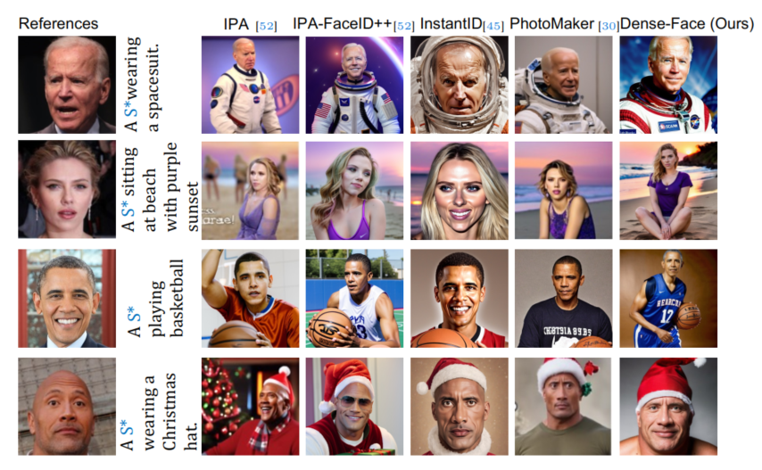
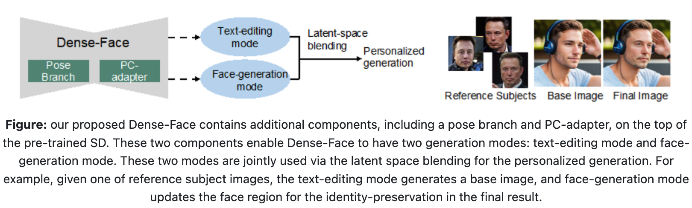

## Dense-face
This repo is the implementation of "Dense-Face: Personalized Face Generation Model via Dense Annotation Prediction". [ArXiv](https://arxiv.org/abs/2412.18149) and [project page](https://chelsea234.github.io/Dense-Face.github.io/).



### Quick Demo
- To create your environment by
  ```
  conda env create -f Dense-Face.yml
  ```
  or mannually install `pytorch=1.12.1` and `torchvision=0.13.1` in `python 3.8`.
- Go to [link](https://drive.google.com/file/d/1D4PiEDvaTQt1fJykfQ5cZSMxrGZjcucF/view?usp=sharing) to download pre-trained weights, and then put them in `inference_code/ckpt`.
- To visualize the results in 
  ```
  cd ./inference_code
  bash inference.sh
  ```
  results are dumped into `./inference_code/output`.
- More qualitative results can be found at: [project page](https://chelsea234.github.io/Dense-Face.github.io/).

### T2I-Dense-Face Dataset
- T2I-Dense-Face contains face images from CASIA and CelebA, and we release the section of CASIA. 
- We offer `dataset_usage/*.ipynb` to help understand the dataset.
- Download `CASIA_tiny` via [link](https://drive.google.com/file/d/1Nr8xwErb8CJc-vnVWj9-hXt260hbk-ce/view?usp=sharing), and put them in `CASIA_tiny`. This is important to run face generation mode.
- If you want to see 5%~10% of the proposed dataset, please find `CASIA_small` via ([link](https://drive.google.com/drive/folders/1AwMiekWqeQryz-sDlNjQkGCTua7rVspE?usp=sharing)), and the download link to `CASIA_full` can be obtained via sending email to guoxia11@msu.edu. 

### Detailed Method



#### Pre-trained Weights
- Download three weights via [link](https://drive.google.com/drive/folders/1bJ54h35VxaMWg25UVhLW6D82weKl8zNI?usp=drive_link), and put them in `inference_code/ckpt`.
- These three weights are used for text-edting mode (\*.safetensors), face generation mode (epoch*.ckpt), and training from scratch (\*init.ckpt). 

#### step 1: Dense-Face's text-editing mode.
- Please refer to `inference_code/stage_1_text_editing/stage_1_text_editing.ipynb`.
- The generated results will be saved in `inference_code/output_stage_1`.
- Do not forget:
 ```bash
  pip install diffusers
 ```

#### step 2: Generate conditions (e.g., face region and head pose) for generation based on the Fig. 8. 
- Using MediaPipe to obtain the face region, please refer to `./annotation_toolbox/dense_annotation_demo.ipynb` [shortcut](./annotation_toolbox/dense_annotation_demo.ipynb) (This script also helps scale the idea of dense-annotation to other face datasets).
- Pose condition will be solved by inference [code](./inference_code/inference.py#L202).
- Please use the pre-trained ArcFace model to dump the subject identify feature.

#### step 3: Dense-Face's face-generation mode.
- Given the conditions generated from step 2, we modify results from step 1. For example, we save reference images and their arcface features in `inference_code/reference_id`; the source image and its face region are in `inference_code/cropped_face/` and `inference_code/mask/`, respectively. Then run: 
 ```
   cd ../inference_code
   bash inference.sh
 ```
- It uses the reference image arcface feature (`inference_code/reference_id`) to inpaint the face region of `inference_code/cropped_face/`.
- The results are dumped into `inference_code/output`

### Source Code Structure.
The quick view on the code structure:
```bash
./Dense-Face
    ├── Dense-Face.yaml 
    ├── inference_code
    │      ├── stage_1_text_editing/stage_1_text_editing.ipynb (the Huggingface interface on Text-based Editing mode.)
    │      ├── inference.py (demo inference code)
    │      ├── inference.sh (demo inference entrance)
    │      ├── main.py (preliminary version train code)
    │      ├── main.sh (train entrance)
    │      ├── reference_id (reference image and arcface feature)
    │      ├── ropped_face (base image)
    │      ├── mask (face region mask)
    │      ├── output (output generated samples)
    │      └── ...
    ├── annotation_toolbox
    │      ├── dense_annotation_demo.ipynb (Crop the SD output image and produce the face region mask)
    │      ├── Dense-Face-mediapipe.yml (env. file for the annotation)
    │      └── ...
    ├── dataset_usage
    │      └── readCelebAFacesDataset.ipynb (Instruction on how to use dataset)
    └── test_samples (we offer 25 celebrity test samples)
```

### Reference
If you think our work is helpful, please cite:
```Bibtex
@article{denseface,
  title={Dense-Face: Personalized Face Generation Model via Dense Annotation Prediction}, 
  author={Xiao Guo and Manh Tran and Jiaxin Cheng and Xiaoming Liu},
  journal={arXiv preprint arXiv:2412.18149},
  year={2024}
}
```